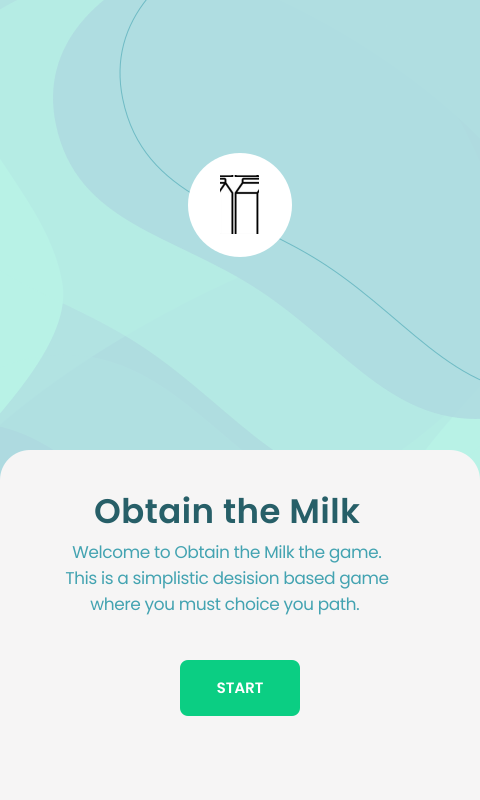
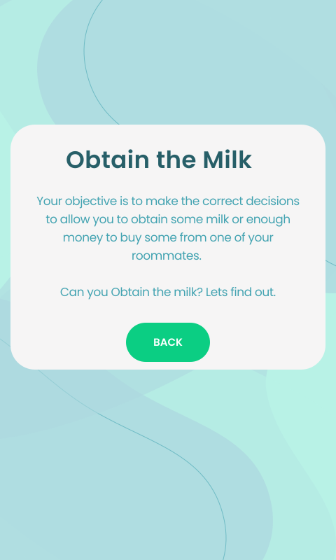
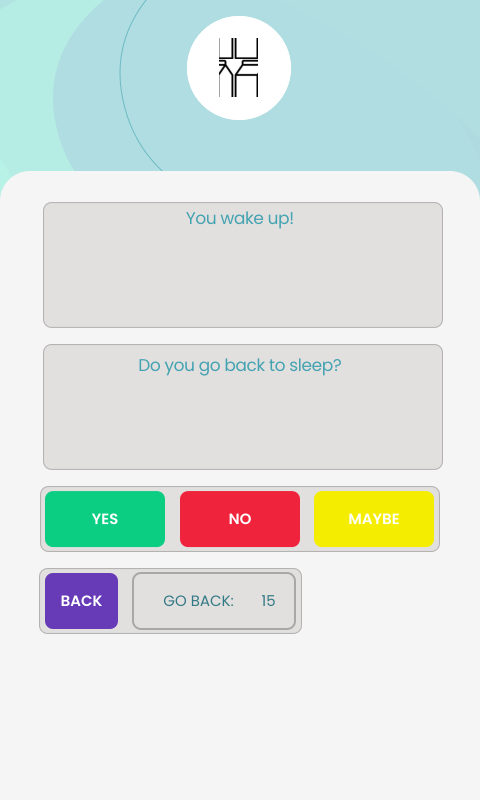
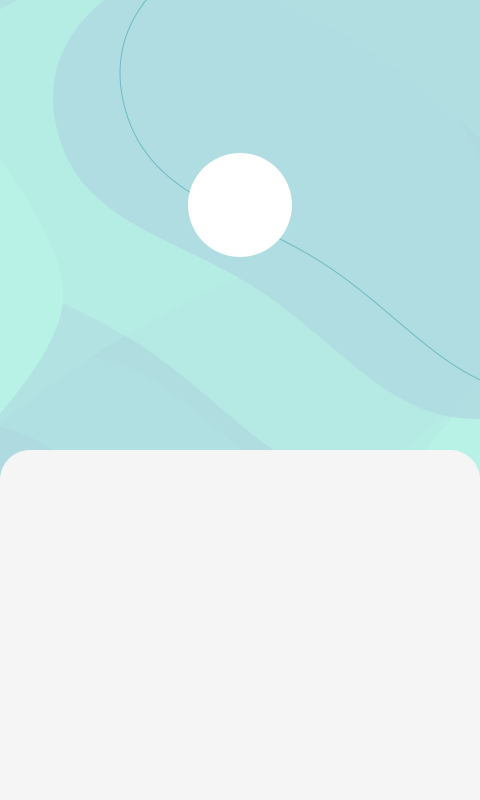
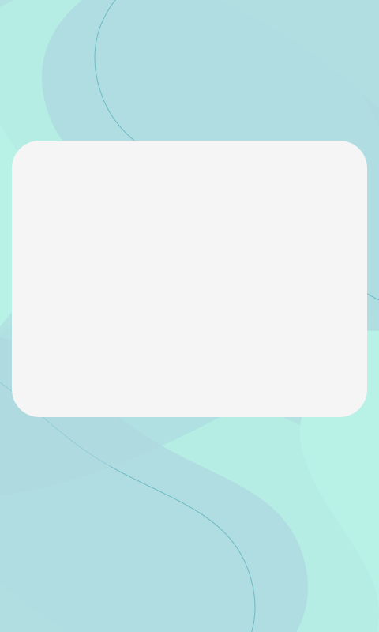
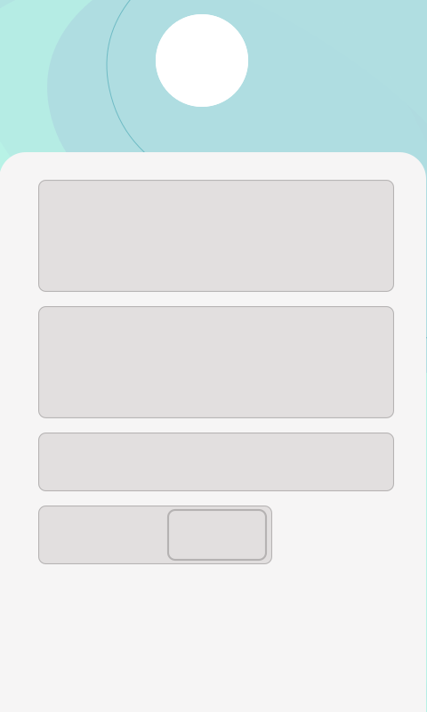

# Design

This document documents the design methodology I used for the creation of my front end application.

## Decision map

After completing my decision map I was able to think in depth about what the front end would require to enable the user to complete the required paths/operations.
I started by designing some Figma design frames for my splash screen, and Interaction screen.  
**I designed these frames on the premise that:**
* The application should be simple to use and easy to understand.
* The application must be able to handle the back end and have the appropriate events/items to make that possible.
* The application should display all the information the user requires to make a informed choice on which path to take.

**I also designed these frames with the idea that:**
* A blue and white colour pallet would be visually appealing as it is soothing to the eyes, and fits the theme of milk.
    * This is because milk is usually white. *(Stored in a blue accent coloured container)*
    * One of the most popular choices of milk is "Whole milk" which is usually represented with a blue accent coloured contained by most brands.

## High-Quality Figma Frames
|Splash Screen|Objective Page|Interaction Screen|
|:-:|:-:|:-:|
||||

### Considerations
Unfortuantly you cant just import SVGs into android studio and have them interactive, they can only be imported as backgrounds non interactive.  This meant I was required to make more simplistic frames which could be imported and used as the backgrounds for my application Empty Activitys.  

#### Simplified Figma Frames
|Splash Screen|Objective Page|Interaction Screen|
|:-:|:-:|:-:|
||||