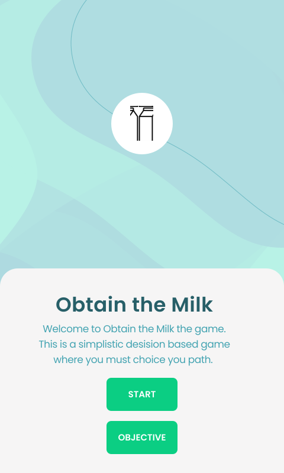
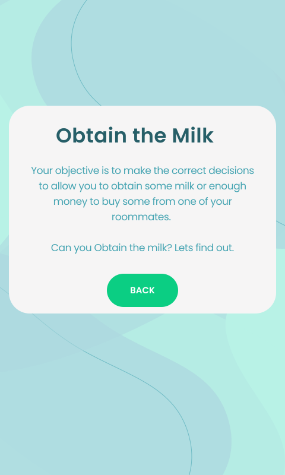
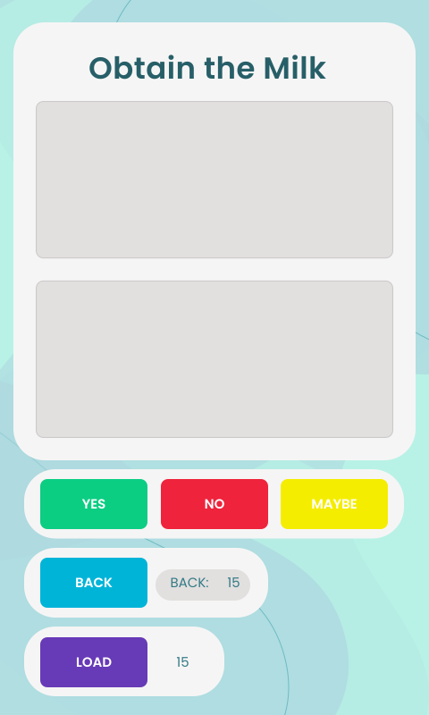
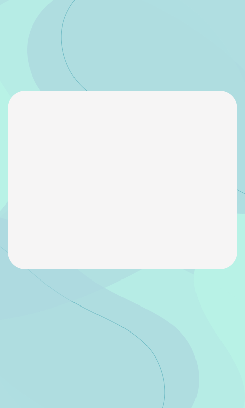
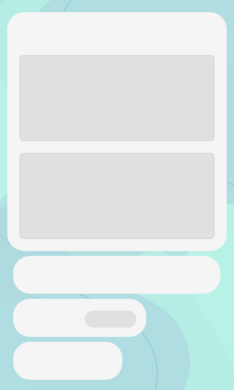

# Testing & Design document

## Testing

**STUDENT NAME:** Harry Seymour  
**STUDENT ID:** UP2006885  
**DATE:** Wednesday 26th January 2022 13:58

### Input Tests
Test ID|Test Description|Test Data|Expected Result|Actual Results|
|:-|----|--|--|--|
|1|What happens if the user tries to input a choice unavailable?|Int: 7|The program asks the user to re-input a choice.|The program redisplays the description, question and prompt to the user.|
|2|What happens if the user tries to input a String?|String: "Seven"|The program asks the user to re-input a choice.|The program crashes due to the unexpected data type.|
|3|What happens if the user tries to input a Float?|Float: 7.234|The program asks the user to re-input a choice.|The program crashes due to the unexpected data type.|
|4|What happens if the user tries to input a Boolean?|Boolean: TRUE|The program asks the user to re-input a choice.|The program crashes due to the unexpected data type.|
|5|What happens if the user tries to continuously input enter as the choice?|Input: (Enter 10 times), Int: 2.|The program asks the user to re-input a choice.|The program waits for the user to input a valid input without outputting any error msgs or resending a msg.|

### Misc Tests

Test ID|Test Description|Test Data|Expected Result|Actual Results|
|:-|----|--|--|--|
|6|What happens if the user tries to choose the 3rd node when it's not available?|Int: 3|The program says unavailable choice.|The program outputs an "Invalid choice" msg and asks the user to press enter to start again.|
|7|What happens if you continuously sleep in and won't wake up?|Int: 1(Looped)|The program should allow the user to sleep for as long as they like as there's no set limit on choices.|The program allows the user to sleep continously (Tested 10 times)|
|8|What happens when you win the program and press enter?|Input: Enter|The program should restart at node 0 for the user to play again.|The program after outputting the msg "You have obtained milk" allows the user to press enter again and starts again at node 0.|

### Navigation Tests

Test ID|Test Description|Test Data|Expected Result|Actual Results|
|:-|----|--|--|--|
|9|Can you navigate to node 5 (WIN)?|Int: 2, 1, 1, 1, 1, 1|It should be possible to win the application by following this path.|The Program allows the user to follow this path and the result is that a win msg is outputted once the user reaches the winning node.|
|10|What happens if like stated in the Decision Map you are unable to repick John? Is it possible to lose?|Int: 2, 1, 2, 1, 2|The program should stop the user from asking John again for milk|If the user declines to talk to archey the program outputs a failed msg and resets to node 0 as Archey is the only option.|
|11|Can you navigate to node 18 (WIN) by talking to John and then being told to talk to Archey?|Int: 2, 1, 2, 1, 1, 1|It should be possible to win the application by following this path.|The Program allows the user to follow this path and the result is that a win msg is outputted once the user reaches the winning node.|
|12|Can you navigate to node 18 (WIN) by going directly to Archey?|Int: 2, 2, 1, 1|It should be possible to win the application by following this path.|The Program allows the user to follow this path and the result is that a win msg is outputted once the user reaches the winning node.|
|13|Can you navigate to node 10 (WIN)?|Int: 2, 1, 2,2, 1|It should be possible to win the application by following this path.|The Program allows the user to follow this path and the result is that a win msg is outputted once the user reaches the winning node.|

### Custom Features Tests

### Previous Nodes / Go back feature

Test ID|Test Description|Test Data|Expected Result|Actual Results|
|:-|----|--|--|--|
|14|What happens if the user tries to use option “4” (Go back to the previous node), when the program starts and there are no previous choices.|Int: 4|The program should output an empty msg.|The program outs a msg stating the Stack (ADT used for storing previously accessed nodes) is currently empty, it then requests the user re-enter a choice.|
|15|What happens if the user tries to use option “4” (Go back to the previous node), after a win or loss, when the program resets them to position 0.|Int: 2, 1, 2,2, 1, 4|The user should be able to go back to the previous steps even if they are win/loss msgs.|
|16|What happens if the user loads a node and then uses the Previous node function?|Int: 4|The user should be sent back to the previous node they interacted with, not the previous node before the node they loaded.|The Program doesnt go back and instead outputs a stack empty msg, this is likely due to the fact the stack is only updated after the first node choice, Node 0 is not added to the stack apon initilisation of the program|
|17|What happens if the user loads a node and then uses the Previous node function?|Int: 2, 4|The user should be sent back to the previous node they interacted with, not the previous node before the node they loaded.|The user is sent back to the previous node.|

### Search feature

Test ID|Test Description|Test Data|Expected Result|Actual Results|
|:-|----|--|--|--|
|18|What happens if the user tries to load position 17.|Int: 5, 17|The program should set the user's node to NodeID 17 and display the correct Description/Question.|The program runs the function and loads the correct node.|
|19|What happens if the user tries to load node -1. (Out of bounds)|Int: 5, -1|The program should output an error msg and ask the user to input another choice.|The program outputs an error msg stating the node is invalid and asks the user to re-enter a choice (Not for loading nodes but for chosing a function/choice).|
|20|What happens if the user tries to load node 72. (Out of bounds)| Int: 5, 72| The program should output an error msg and ask the user to input another choice.||

### Testing Evidence

Testing evidence (Code blocks & Photos) is stored in ./evidence/README.md
*Testing evidence can be found by using the TestID*  

## Design Methodology

After completing my decision map I was able to think in depth about what the front end would require to enable the user to complete the required paths/operations.
I started by designing some Figma design frames for my Splash screen, Objective page & Interaction screen.

**I thought about 3 key statments when designing my frames which would be used for my front end:**
1. The application should be simple to use and easy to understand.
2. The application must be able to handle the back end and have the appropriate events handlers to make that possible.
3. The application should display all the information the user requires to make a informed choice on which path to take.

**I though about what type of colour pallet would be suited towards my application:**
* I decided on a blue and white colour pallet which would be visually appealing as it is soothing to the eyes, and fits the theme of milk, this is because:
    1. Milk is usually white.
    2. One of the most popular choices of milk is "Whole milk" which is usually represented with a blue accent coloured container by most brands.

### High-Quality Figma Frames

|Splash Screen|Objective Page|Interaction Screen|
|:-:|:-:|:-:|
||||

## Considerations
Unfortuantly you cant just import SVGs into android studio and have them interactive, they can only be imported as backgrounds non interactive.  This meant I was required to make more simplistic frames which could be imported and used as the backgrounds for my application Empty Activitys. 

### Simplified Figma Frames

|Splash Screen|Objective Page|Interaction Screen|
|:-:|:-:|:-:|
||||
