# Testing Evidence

*Testing evidence can be found by using the TestID*  

## Evidence

### Test 1

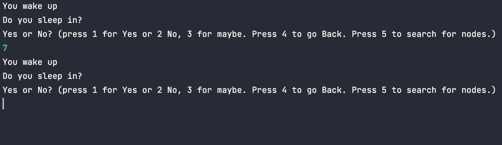

### Test 2

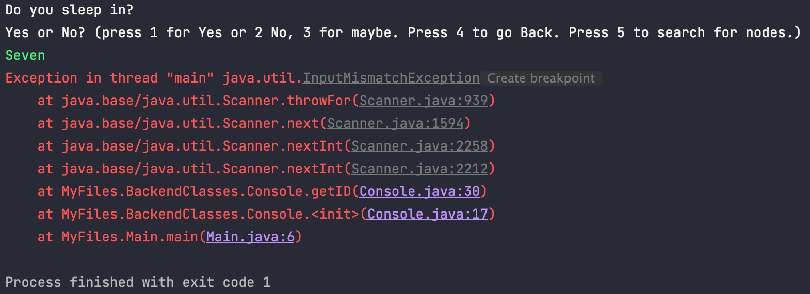

### Test 3

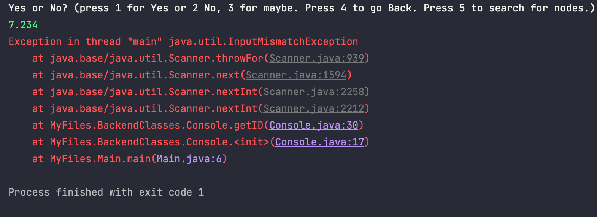

### Test 4

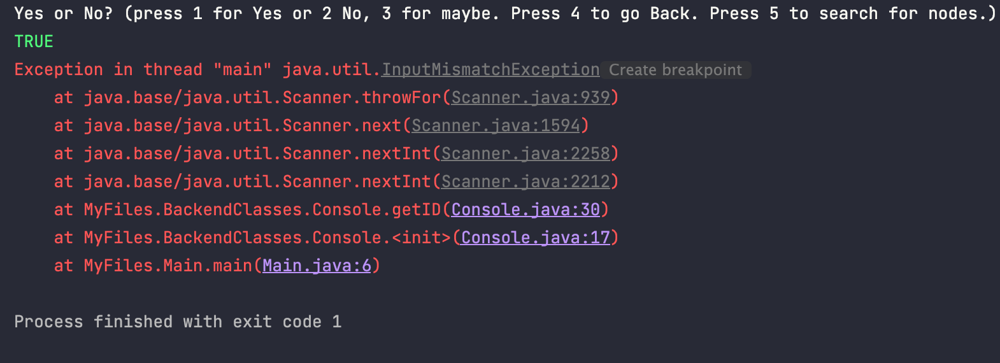

### Test 5

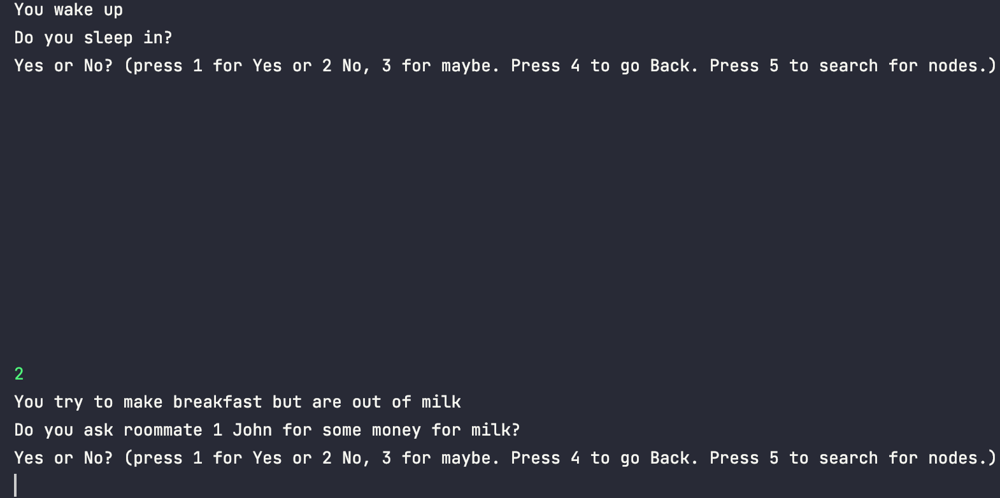

### Test 6

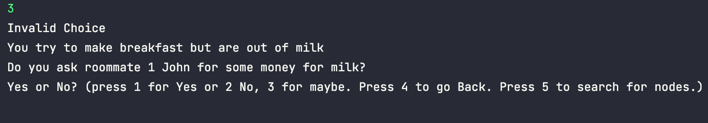

### Test 7
```java
You wake up
Do you sleep in?
Yes or No? (press 1 for Yes or 2 No, 3 for maybe. Press 4 to go Back. Press 5 to search for nodes.)
1
You wake up
Do you sleep in?
Yes or No? (press 1 for Yes or 2 No, 3 for maybe. Press 4 to go Back. Press 5 to search for nodes.)
1
You wake up
Do you sleep in?
Yes or No? (press 1 for Yes or 2 No, 3 for maybe. Press 4 to go Back. Press 5 to search for nodes.)
1
You wake up
Do you sleep in?
Yes or No? (press 1 for Yes or 2 No, 3 for maybe. Press 4 to go Back. Press 5 to search for nodes.)
1
You wake up
Do you sleep in?
Yes or No? (press 1 for Yes or 2 No, 3 for maybe. Press 4 to go Back. Press 5 to search for nodes.)
1
You wake up
Do you sleep in?
Yes or No? (press 1 for Yes or 2 No, 3 for maybe. Press 4 to go Back. Press 5 to search for nodes.)
1
...
```

### Test 8

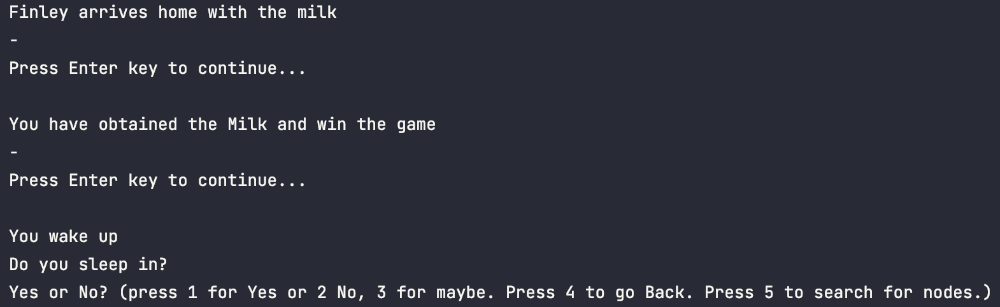

### Test 9
```java
You wake up
Do you sleep in?
Yes or No? (press 1 for Yes or 2 No, 3 for maybe. Press 4 to go Back. Press 5 to search for nodes.)
2
You try to make breakfast but are out of milk
Do you ask roommate 1 John for some money for milk?
Yes or No? (press 1 for Yes or 2 No, 3 for maybe. Press 4 to go Back. Press 5 to search for nodes.)
1
John then asks who last drank the milk
Do you tell John Finley drank the milk last?
Yes or No? (press 1 for Yes or 2 No, 3 for maybe. Press 4 to go Back. Press 5 to search for nodes.)
1
John tells you to phone Finley and that if he doesnt pick up to ask Archey instead
Do you phone Finley?
Yes or No? (press 1 for Yes or 2 No, 3 for maybe. Press 4 to go Back. Press 5 to search for nodes.)
1
Finley picks up and asks what do you want
Do you tell Finley he last drank the milk?
Yes or No? (press 1 for Yes or 2 No, 3 for maybe. Press 4 to go Back. Press 5 to search for nodes.)
1
Finley says he will pick up the milk
50% Chance pick Yes or No
Yes or No? (press 1 for Yes or 2 No, 3 for maybe. Press 4 to go Back. Press 5 to search for nodes.)
1
Finley arrives home with the milk
-
Press Enter key to continue...

You have obtained the Milk and win the game
...
```

### Test 10

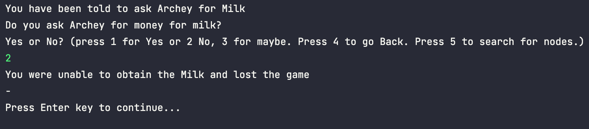

### Test 11

```java
You wake up
Do you sleep in?
Yes or No? (press 1 for Yes or 2 No, 3 for maybe. Press 4 to go Back. Press 5 to search for nodes.)
2
You try to make breakfast but are out of milk
Do you ask roommate 1 John for some money for milk?
Yes or No? (press 1 for Yes or 2 No, 3 for maybe. Press 4 to go Back. Press 5 to search for nodes.)
1
John then asks who last drank the milk
Do you tell John Finley drank the milk last?
Yes or No? (press 1 for Yes or 2 No, 3 for maybe. Press 4 to go Back. Press 5 to search for nodes.)
2
-
Do you tell John Archey drank the milk last?
Yes or No? (press 1 for Yes or 2 No, 3 for maybe. Press 4 to go Back. Press 5 to search for nodes.)
1
You have been told to ask Archey for Milk
Do you ask Archey for money for milk?
Yes or No? (press 1 for Yes or 2 No, 3 for maybe. Press 4 to go Back. Press 5 to search for nodes.)
1
You decided to ask Archey for milk he then asks who last drank the milk
Do you tell Archey he last drank the milk?
Yes or No? (press 1 for Yes or 2 No, 3 for maybe. Press 4 to go Back. Press 5 to search for nodes.)
1
Archey offers to buy some milk
-
Press Enter key to continue...
...
```

### Test 12
```Java
You wake up
Do you sleep in?
Yes or No? (press 1 for Yes or 2 No, 3 for maybe. Press 4 to go Back. Press 5 to search for nodes.)
2
You try to make breakfast but are out of milk
Do you ask roommate 1 John for some money for milk?
Yes or No? (press 1 for Yes or 2 No, 3 for maybe. Press 4 to go Back. Press 5 to search for nodes.)
2
You try to make breakfast but are out of milk
Do you ask roommate 2 Archey for some money for milk?
Yes or No? (press 1 for Yes or 2 No, 3 for maybe. Press 4 to go Back. Press 5 to search for nodes.)
1
You decided to ask Archey for milk he then asks who last drank the milk
Do you tell Archey he last drank the milk?
Yes or No? (press 1 for Yes or 2 No, 3 for maybe. Press 4 to go Back. Press 5 to search for nodes.)
1
Archey offers to buy some milk
-
Press Enter key to continue...
...
```

### Test 13
```Java
You wake up
Do you sleep in?
Yes or No? (press 1 for Yes or 2 No, 3 for maybe. Press 4 to go Back. Press 5 to search for nodes.)
2
You try to make breakfast but are out of milk
Do you ask roommate 1 John for some money for milk?
Yes or No? (press 1 for Yes or 2 No, 3 for maybe. Press 4 to go Back. Press 5 to search for nodes.)
1
John then asks who last drank the milk
Do you tell John Finley drank the milk last?
Yes or No? (press 1 for Yes or 2 No, 3 for maybe. Press 4 to go Back. Press 5 to search for nodes.)
2
-
Do you tell John Archey drank the milk last?
Yes or No? (press 1 for Yes or 2 No, 3 for maybe. Press 4 to go Back. Press 5 to search for nodes.)
2
-
Do you tell John You drank the milk last?
Yes or No? (press 1 for Yes or 2 No, 3 for maybe. Press 4 to go Back. Press 5 to search for nodes.)
1
John offers to buy you the milk
-
Press Enter key to continue...
...
```

### Test 14

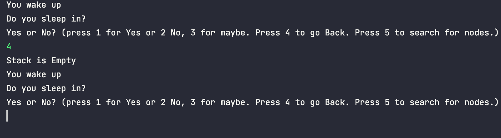

### Test 15

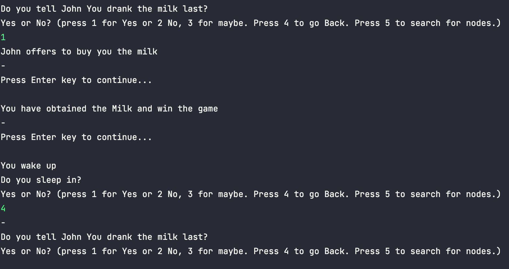

### Test 16

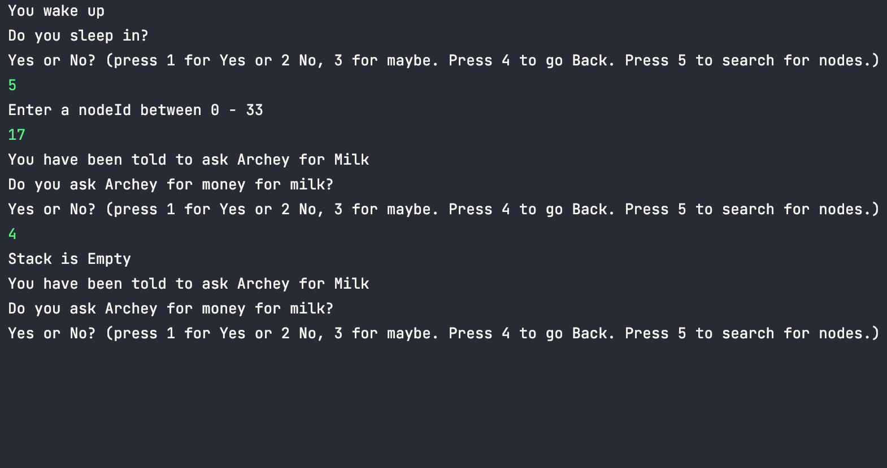

### Test 17

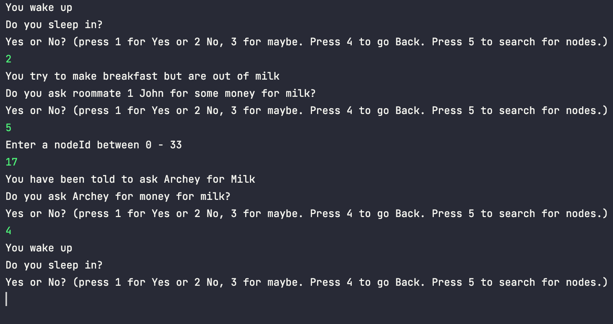

### Test 18

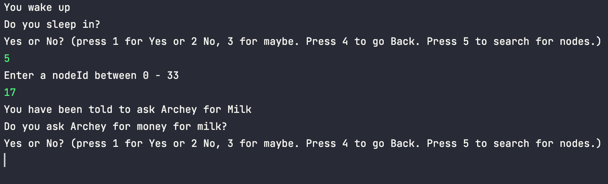

### Test 19

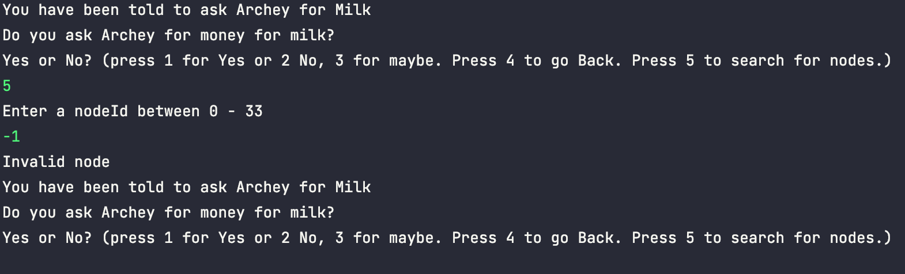

### Test 20

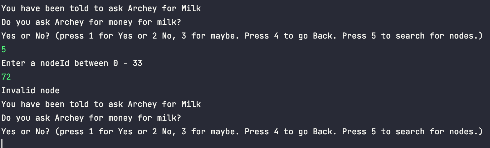
