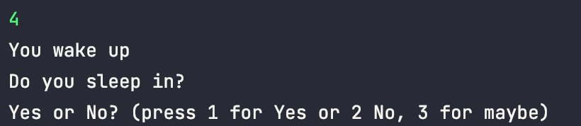

# Testing Documentation

**STUDENT NAME:** Harry Seymour  
**STUDENT ID:** UP2006885  
**DATE:** Wednesday 26th January 2022 13:58

|Test ID|Test Description|Test Data|Expected Result|Actual Results|
|:-|----|--|--|--|
|1|What happens if the user trys to input a choice unavailable.|Int: 4|The program asks the user to re-input a choice|No error message is outputted but that program due to its exception statements resends the msg asking for the input again.|

## Test Evidence

### Test 1

