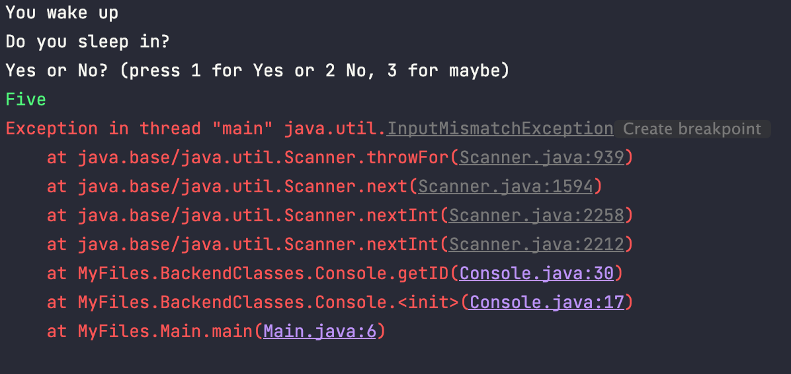
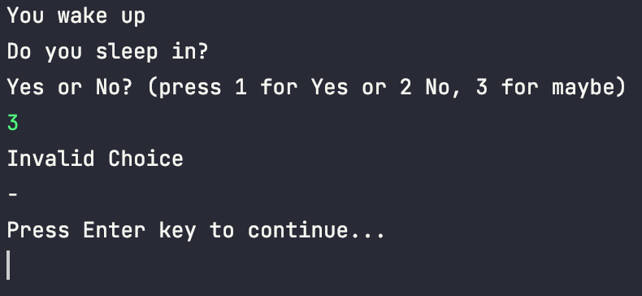
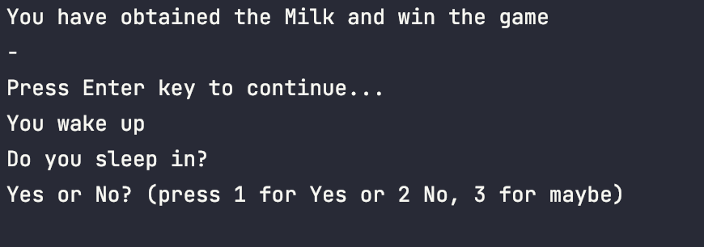
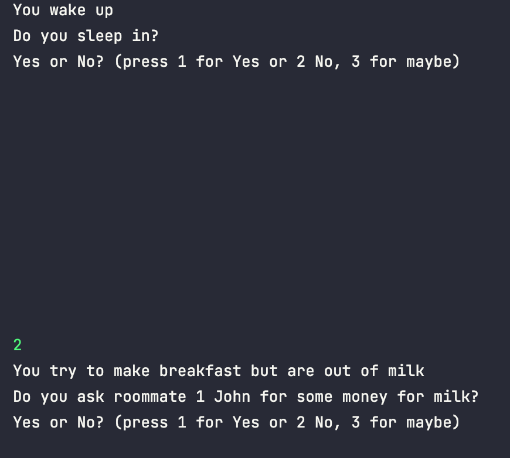

# Testing Documentation

**STUDENT NAME:** Harry Seymour  
**STUDENT ID:** UP2006885  
**DATE:** Wednesday 26th January 2022 13:58

## Tests

|Test ID|Test Description|Test Data|Expected Result|Actual Results|
|:-|----|--|--|--|
|1|What happens if the user trys to input a choice unavailable.|Int: 4|The program asks the user to re-input a choice|No error message is outputted but that program due to its exception statements resends the msg asking for the input again.|
|2|What happens if the user trys to input a choice unavailable.|String: "Five"|The program asks the user to re-input a choice|The program crashes due to the unexpected data type.|
|3|What happens if the user trys to chose the 3rd node when its not available.|Int: 3|The program says unavailable choice.|The program outputs an "Invalid choice" msg and asks the user to press enter to start again.|
|4|Can you navigate to node 8 (WIN)|Int: 2, 1, 1, 1, 1, 1|It should be possible to win the application my following this path.|The Program allows the user to follow this path and the result is that a win msg is outputted once the user reaches the winning node.|
|5|What happens if you continuously sleep in and dont wake up| Int: 1 (Looped)|The program should allow the user to sleep for aslong as they like as theres no set limit on choices.|The program allows the user to sleep continously (Tested 32 times)|
|6|What happens when you win the program and press enter? |Enter|The program should restart at node 0 for the user to play again.|The program after outputting the msg "You have obtained milk" allows the user to press enter again and starts again at node 0.|
|7|What happens if like stated in the Decision Map you are unable to repick John? Is it possible to lose. |Int: 2, 1, 2, 1, 2|The program should stop the user from asking John again for milk|The program outputs a failed msg and resets to node 0.|
|8|Can you navigate to node 20 (WIN) by talking to John and then being told to talk to Archey.|Int: 2, 1, 2, 1, 1, 1|It should be possible to win the application my following this path.|The Program allows the user to follow this path and the result is that a win msg is outputted once the user reaches the winning node.|
|9|Can you navigate to node 20 (WIN) by going directly to Archey |Int: 2, 1, 2, 1, 1, 1|It should be possible to win the application my following this path.|The Program allows the user to follow this path and the result is that a win msg is outputted once the user reaches the winning node.|
|10|Can you navigate to node 14 (WIN)|Int: 2, 1, 2,2, 1|It should be possible to win the application my following this path.|The Program allows the user to follow this path and the result is that a win msg is outputted once the user reaches the winning node.|
|11|What happens if the user trys to continuously input enter as the choice.|Enter*10, Int: 2.|The program asks the user to re-input a choice|The program waits for the user to input a valid input without outputting any error msgs or resending a msg.|

## Test Evidence

### Test 1


### Test 2



### Test 3



### Test 4

```shell
You wake up
Do you sleep in?
Yes or No? (press 1 for Yes or 2 No, 3 for maybe)
2
You try to make breakfast but are out of milk
Do you ask roommate 1 John for some money for milk?
Yes or No? (press 1 for Yes or 2 No, 3 for maybe)
1
John then asks who last drank the milk
Do you tell John Finley drank the milk last?
Yes or No? (press 1 for Yes or 2 No, 3 for maybe)
1
John tells you to phone Finley and that if he doesnt pick up to ask Archey instead
Do you phone Finley?
Yes or No? (press 1 for Yes or 2 No, 3 for maybe)
1
Finley picks up and asks what do you want
Do you tell Finley he last drank the milk?
Yes or No? (press 1 for Yes or 2 No, 3 for maybe)
1
Finley says he will pick up the milk
50% Chance pick Yes or No
Yes or No? (press 1 for Yes or 2 No, 3 for maybe)
1
Finley arrives home with the milk
-
Press Enter key to continue...


You have obtained the Milk and win the game
-
Press Enter key to continue...
```

### Test 6



### Test 7

```shell
You wake up
Do you sleep in?
Yes or No? (press 1 for Yes or 2 No, 3 for maybe)
2
You try to make breakfast but are out of milk
Do you ask roommate 1 John for some money for milk?
Yes or No? (press 1 for Yes or 2 No, 3 for maybe)
1
John then asks who last drank the milk
Do you tell John Finley drank the milk last?
Yes or No? (press 1 for Yes or 2 No, 3 for maybe)
2
-
Do you tell John Archey drank the milk last?
Yes or No? (press 1 for Yes or 2 No, 3 for maybe)
1
You have been told to ask Archey for Milk
Do you ask Archey for money for milk?
Yes or No? (press 1 for Yes or 2 No, 3 for maybe)
2
You were unable to obtain the Milk and lost the game
-
Press Enter key to continue...
```

### Test 8

```shell
You wake up
Do you sleep in?
Yes or No? (press 1 for Yes or 2 No, 3 for maybe)
2
You try to make breakfast but are out of milk
Do you ask roommate 1 John for some money for milk?
Yes or No? (press 1 for Yes or 2 No, 3 for maybe)
1
John then asks who last drank the milk
Do you tell John Finley drank the milk last?
Yes or No? (press 1 for Yes or 2 No, 3 for maybe)
2
-
Do you tell John Archey drank the milk last?
Yes or No? (press 1 for Yes or 2 No, 3 for maybe)
1
You have been told to ask Archey for Milk
Do you ask Archey for money for milk?
Yes or No? (press 1 for Yes or 2 No, 3 for maybe)
1
You decided to ask Archey for milk he then asks who last drank the milk
Do you tell Archey he last drank the milk?
Yes or No? (press 1 for Yes or 2 No, 3 for maybe)
1
Archey offers to buy some milk
-
Press Enter key to continue...

You have obtained the Milk and win the game
```

### Test 9

```shell
You wake up
Do you sleep in?
Yes or No? (press 1 for Yes or 2 No, 3 for maybe)
2
You try to make breakfast but are out of milk
Do you ask roommate 1 John for some money for milk?
Yes or No? (press 1 for Yes or 2 No, 3 for maybe)
2
You try to make breakfast but are out of milk
Do you ask roommate 2 Archey for some money for milk?
Yes or No? (press 1 for Yes or 2 No, 3 for maybe)
1
You decided to ask Archey for milk he then asks who last drank the milk
Do you tell Archey he last drank the milk?
Yes or No? (press 1 for Yes or 2 No, 3 for maybe)
1
Archey offers to buy some milk
-
Press Enter key to continue...

You have obtained the Milk and win the game
```

### Test 10

```shell
You wake up
Do you sleep in?
Yes or No? (press 1 for Yes or 2 No, 3 for maybe)
2
You try to make breakfast but are out of milk
Do you ask roommate 1 John for some money for milk?
Yes or No? (press 1 for Yes or 2 No, 3 for maybe)
1
John then asks who last drank the milk
Do you tell John Finley drank the milk last?
Yes or No? (press 1 for Yes or 2 No, 3 for maybe)
2
-
Do you tell John Archey drank the milk last?
Yes or No? (press 1 for Yes or 2 No, 3 for maybe)
2
-
Do you tell John You drank the milk last?
Yes or No? (press 1 for Yes or 2 No, 3 for maybe)
1
John offers to buy you the milk
-
Press Enter key to continue...

You have obtained the Milk and win the game
```

### Test 11

